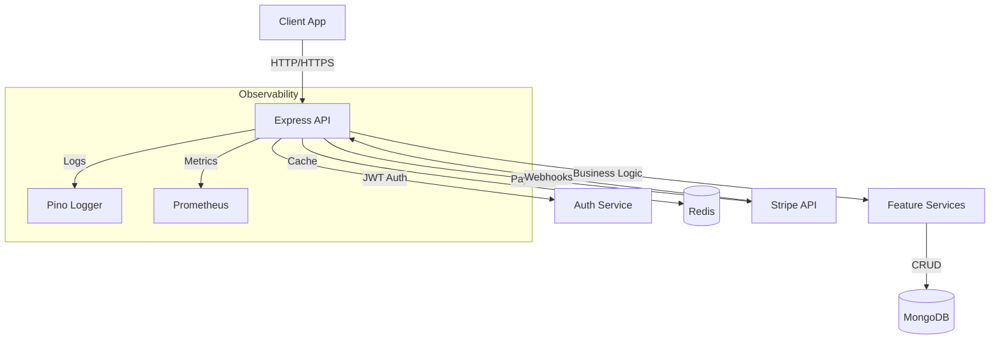

# 🛒 Production-Grade E-Commerce API

A **senior-level**, production-ready REST API built with Node.js, TypeScript, Express, MongoDB, and Redis. This project demonstrates enterprise-grade practices including authentication, caching, payment processing, observability, and containerization.

## 🏗️ Architecture

