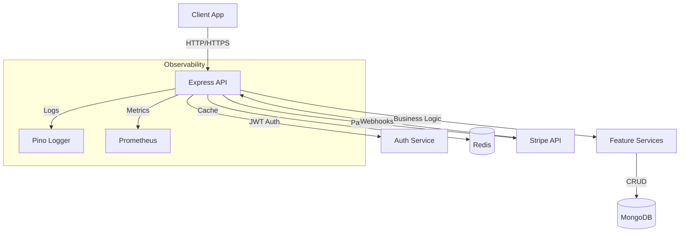

# 🛒 Production-Grade E-Commerce API

A **senior-level**, production-ready REST API built with Node.js, TypeScript, Express, MongoDB, and Redis. This project demonstrates enterprise-grade practices including authentication, caching, payment processing, observability, and containerization.

## 🏗️ Architecture



## 📋 Prerequisites

Before you begin, ensure you have the following installed:

- **Node.js** (v20 or higher) - [Download](https://nodejs.org/)
- **npm** or **yarn** - Comes with Node.js
- **MongoDB** (v7.0 or higher) - [Download](https://www.mongodb.com/try/download/community) or use Docker
- **Redis** - [Download](https://redis.io/download) or use Docker
- **Git** - [Download](https://git-scm.com/)

Optional for development:
- **Docker & Docker Compose** - [Download](https://www.docker.com/)
- **Stripe CLI** (for webhook testing) - [Download](https://stripe.com/docs/stripe-cli)

## 🚀 Setup Instructions

### Option 1: Local Development Setup

#### Step 1: Clone the Repository

```bash
git clone <repository-url>
cd ecommerce-api
```

#### Step 2: Install Dependencies

```bash
npm install
```

#### Step 3: Environment Configuration

Copy the example environment file and configure your environment variables:

```bash
cp .env.example .env
```

Edit `.env` and update the following variables:

```env
NODE_ENV=development
PORT=3000
MONGO_URI=mongodb://127.0.0.1:27017/ecommerce_db
JWT_SECRET=your_secure_jwt_secret_key_here
JWT_REFRESH_SECRET=your_secure_refresh_secret_key_here
ACCESS_TOKEN_EXPIRY=15m
REFRESH_TOKEN_EXPIRY=7d
REDIS_URL=redis://127.0.0.1:6379
STRIPE_SECRET_KEY=sk_test_your_stripe_secret_key
STRIPE_WEBHOOK_SECRET=whsec_your_webhook_secret
FRONTEND_URL=http://localhost:5173
CLOUDINARY_CLOUD_NAME=your_cloudinary_cloud_name
CLOUDINARY_API_KEY=your_cloudinary_api_key
CLOUDINARY_API_SECRET=your_cloudinary_api_secret
```

> ⚠️ **Security Note**: Never commit `.env` files to version control. Use strong, unique secrets in production.

#### Step 4: Start MongoDB and Redis

**Using Docker (Recommended):**
```bash
docker run -d -p 27017:27017 --name mongodb mongo:7.0
docker run -d -p 6379:6379 --name redis redis:alpine
```

**Or install locally:**
- MongoDB: Follow the [installation guide](https://www.mongodb.com/docs/manual/installation/)
- Redis: Follow the [installation guide](https://redis.io/docs/getting-started/installation/)

#### Step 5: Run Database Migrations

```bash
npx migrate-mongo up
```

#### Step 6: Seed the Database (Optional)

To populate the database with sample data:

```bash
npm run seed
```

#### Step 7: Start the Development Server

```bash
npm run dev
```

The API will be available at `http://localhost:3000`

---

### Option 2: Docker Setup (Recommended for Production)

#### Step 1: Clone the Repository

```bash
git clone <repository-url>
cd ecommerce-api
```

#### Step 2: Configure Environment Variables

You can either:
- Copy `.env.example` to `.env` and modify as needed
- Or use the environment variables defined in `docker-compose.yml`

```bash
cp .env.example .env
```

#### Step 3: Build and Start All Services

```bash
docker-compose up --build
```

This will start:
- **API** on port 3000
- **MongoDB** on port 27017
- **Redis** on port 6379

#### Step 4: Run Migrations (inside the API container)

```bash
docker-compose exec api npx migrate-mongo up
```

#### Step 5: Seed the Database (Optional)

```bash
docker-compose exec api npm run seed
```

To stop the services:
```bash
docker-compose down
```

To stop and remove all volumes (database data):
```bash
docker-compose down -v
```

---

## 🧪 Running Tests

```bash
# Run all tests
npm test

# Run tests in watch mode during development
npm run test:watch
```

---

## 📦 Available Scripts

| Command | Description |
|---------|-------------|
| `npm run dev` | Start development server with hot reload |
| `npm run build` | Compile TypeScript to JavaScript |
| `npm run start` | Start production server |
| `npm test` | Run test suite |
| `npm run test:watch` | Run tests in watch mode |
| `npm run lint` | Run ESLint for code quality |
| `npm run format` | Format code with Prettier |
| `npm run seed` | Seed database with sample data |
| `npx migrate-mongo up` | Run database migrations |
| `npx migrate-mongo down` | Rollback last migration |
| `npx migrate-mongo status` | Check migration status |

---

## 🔍 API Documentation

Once the server is running, access the Swagger documentation at:
```
http://localhost:3000/api-docs
```

---

## 📁 Project Structure

```
ecommerce-api/
├── src/
│   ├── config/         # Configuration files
│   ├── controllers/    # Request handlers
│   ├── middleware/     # Custom middleware
│   ├── models/         # Mongoose models
│   ├── routes/         # API routes
│   ├── services/       # Business logic
│   ├── utils/          # Utility functions
│   └── index.ts        # Application entry point
├── migrations/         # Database migrations
├── tests/              # Test files
├── .env.example        # Environment template
├── docker-compose.yml  # Docker services configuration
├── Dockerfile          # Docker build instructions
└── package.json        # Project dependencies
```

---

## 🔐 Security Features

- JWT Authentication with refresh tokens
- Password hashing with bcryptjs
- Rate limiting
- Helmet security headers
- CORS protection
- Input validation with Zod
- MongoDB injection prevention
- XSS protection

---

## 🛠️ Troubleshooting

### MongoDB Connection Issues
```bash
# Check if MongoDB is running
docker ps | grep mongodb

# Restart MongoDB container
docker restart mongodb
```

### Redis Connection Issues
```bash
# Check if Redis is running
docker ps | grep redis

# Test Redis connection
docker exec -it redis redis-cli ping
```

### Port Already in Use
If port 3000 is already in use, change the PORT in your `.env` file:
```env
PORT=3001
```

### Clear npm Cache
```bash
npm cache clean --force
rm -rf node_modules package-lock.json
npm install
```

---

## 📄 License

ISC
